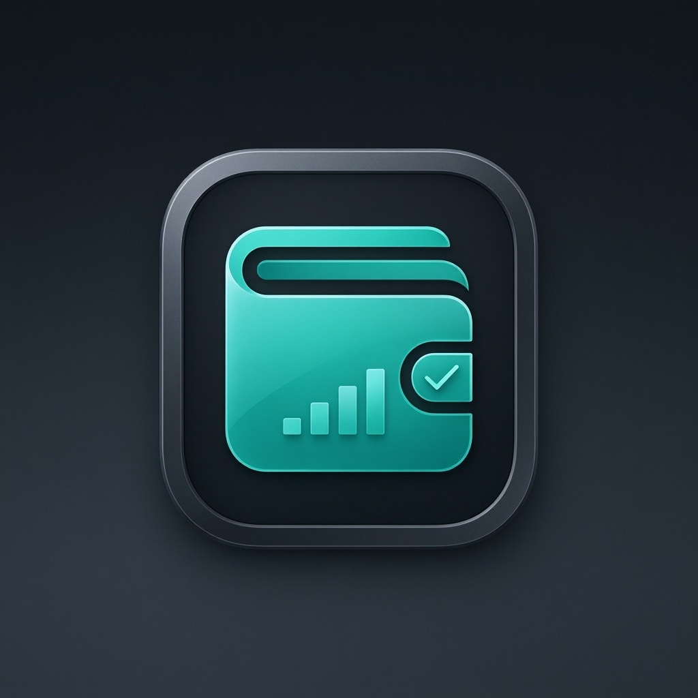

# Smart Expense Tracker

A modern, fully responsive personal finance web app built with **React**, **TypeScript**, **Vite**, and **Tailwind CSS**. It helps users record income and expenses, track spending, manage budgets, and view balances at a glance — all in a polished dark HD interface.

*A Smart Expense Tracker is a web application that helps users manage their personal finances by recording income and expenses, tracking daily transactions, and monitoring their budget. It provides a simple and user-friendly interface for organizing financial data and improving money management. The application is built using React, TypeScript, Vite, and Tailwind CSS, making it fast, responsive, and modern.

Key Features
💰 Add income and expense records.
📊 View financial summary.
📅 Track daily transactions.
📈 Monitor spending habits.
📱 Responsive design for all devices.
⚡ Fast performance with Vite.
🎨 Modern user interface using Tailwind CSS.
Technologies Used.
React.
TypeScript.
Vite.
Tailwind CSS.
HTML5.
CSS3.
JavaScript (ES6+).
Objective.

The main objective of the Smart Expense Tracker is to help users record, organize, and analyze their financial activities, enabling them to make better budgeting decisions and maintain financial discipline.

#Benefits.
Easy expense management
Better budget planning
Improved financial awareness
Quick access to transaction history
Clean, responsive, and user-friendly interface



## ✨ Features

- 🟢 **Add income transactions** with amount, date, category, and optional description
- 🔴 **Add expense transactions** using the same simple form
- 💰 **Live balance calculation**:
  - Total Income (light green)
  - Total Expenses (light red)
  - Net Balance (teal brand accent)
- 🧾 **Full transaction history** in a clean, sortable-feel table
- ✏️ **Inline editing** for every field of any transaction (CRUD update)
- 🗑️ **Delete individual transactions** or clear all with confirmation
- 🔍 **Search** by description or category
- 🎚️ **Filter** by All / Income / Expense
- 💾 **Local storage persistence** — your data is saved automatically in your browser
- 📱 **Fully responsive** for mobile, tablet, and desktop
- 🎨 **HD premium UI** with smooth hover effects, subtle gradients, and a breathing logo glow
- 🔒 **Privacy-first**: no accounts, no server, no external data sharing

## 🛠️ Tech Stack

- **React 18+** with hooks (`useState`, `useEffect`, `useMemo`)
- **TypeScript** for type safety
- **Vite** for fast development and optimized production builds
- **Tailwind CSS** for styling
- **LocalStorage API** for persistence
- **Intl.NumberFormat** for currency formatting (USD)


## 🚀 Getting Started

### Prerequisites

- Node.js 18+ recommended
- npm, pnpm, or yarn

### Install dependencies

```bash
npm install
```

### Run the dev server

```bash
npm run dev
```

Then open the URL shown in your terminal (usually http://localhost:5173).

### Build for production

```bash
npm run build
```

### Preview production build

```bash
npm run preview
```

## 📁 Project Structure

```
.
├── public/
│   └── images/
│       └── smart-expense-tracker-logo.png
├── src/
│   ├── App.tsx          # Main app: state, CRUD, UI
│   ├── index.css        # Tailwind imports
│   ├── main.tsx         # React root entry
│   └── utils/
│       └── cn.ts        # Class-name helper
├── index.html
├── package.json
├── tsconfig.json
├── vite.config.ts
└── README.md
```

## 🧠 How It Works

### Data model

Each transaction is stored as a typed object:

```ts
interface Transaction {
  id: string;
  type: "income" | "expense";
  category: string;
  description: string;
  amount: number;
  date: string; // ISO date string
}
```

### Persistence

- On first load, transactions are hydrated from `localStorage` under the key:
  `expense-tracker:transactions-v1`
- After every add/edit/delete/clear, the updated list is written back to `localStorage`.
- Data is validated and sanitized on load to prevent broken entries.

### CRUD operations

- **Create**: Submit the “Add transaction” form (income or expense).
- **Read**: All transactions are shown in the history table; filters/search apply to the displayed list.
- **Update**: Click “Edit” on any row, modify fields inline, and click “Save”.
- **Delete**: Click “Delete” on a row, or use “Clear all” to reset everything (with confirmation).

### Totals

Totals are computed with `useMemo` for performance:

- `income`: sum of all transactions with type `income`
- `expense`: sum of all transactions with type `expense`
- `balance`: `income − expense`

There is also a “visible totals” strip below the table that reflects totals for the currently filtered/searched set.

## 🖼️ Logo

The app logo is a custom-generated rounded-square fintech-style icon in teal on a dark background, shown prominently at the top center of the header and also used as the browser favicon.

## © Copyright

© 2026 **Taimour Sultan**. All Rights Reserved.

## 📝 License

This project is provided as-is for personal and demonstration use.
